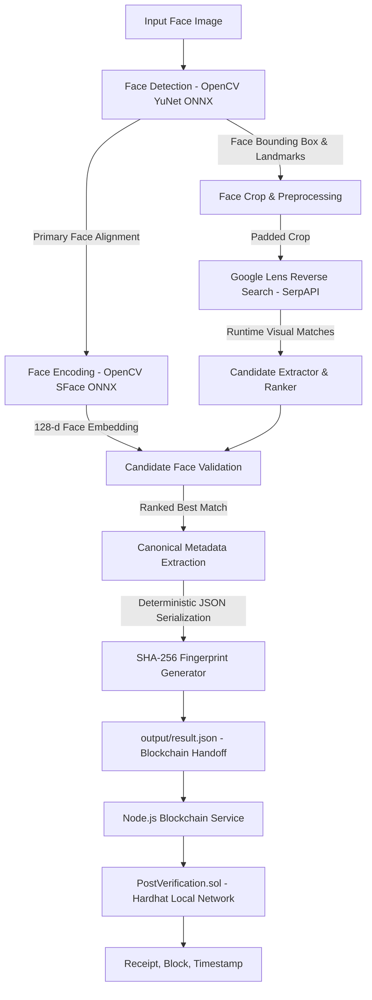

# FaceProof: Face Identification & Web Verification Pipeline

FaceProof is a high-precision, modular Python pipeline that takes a face scan as input, detects and encodes facial features, queries real-time reverse image search via Google Lens (SerpAPI), extracts and ranks matching web/social media content, and generates a deterministic SHA-256 cryptographic fingerprint ready for blockchain registration.

> **Scope Note**: This project implements the complete pipeline through local blockchain registration and verification. The Python pipeline writes the structured handoff artifact (`output/result.json`), and the Node.js layer registers its matched post on a local Hardhat network.

---

## Architecture Overview



---

## Features & Capabilities

- **ONNX Face Detection (YuNet)**: Fast, reliable face detection with 5-point facial landmark extraction. Automatically downloads lightweight ONNX models on first run (no dlib/CMake compilation issues).
- **Face Preprocessing & Padded Cropping**: Generates contextual crops around the primary face (default 25% padding margin) saved to `output/processed/`.
- **128-d Face Embedding (SFace)**: Generates L2-normalized facial feature representations and calculates cosine facial similarity metrics.
- **Genuine Runtime Reverse-Image Search**: Executes live queries to Google Lens via SerpAPI at runtime. No hardcoded or pre-selected URLs.
- **Explainable Candidate Ranking**: Ranks discovered content transparently based on search engine visual rank and best-effort face similarity on downloadable candidate thumbnails.
- **Deterministic Cryptographic Fingerprinting**: Serializes discovered immutable metadata into deterministic JSON (`sort_keys=True`, `separators=(',', ':')`) and computes a 64-character SHA-256 digest.
- **Structured Blockchain Handoff**: Produces `output/result.json` specifically structured for another developer to read `fingerprint` and register on-chain.
- **Rich Terminal UI**: Polished CLI with step-by-step progress tracking (`[1/6]` through `[6/6]`), formatted comparison tables, and user-friendly error messages.
- **Dry-Run Mode**: Offline verification flag (`--dry-run`) to test local face processing and fingerprint generation without consuming API quota.
- **Local Blockchain Verification**: Registers the matched post fingerprint in a Solidity contract running on a local Hardhat node, then detects modified post data.

---

## Tech Stack

| Component | Technology |
|---|---|
| Runtime | Python 3.11+ |
| Face Detection | OpenCV YuNet (ONNX) |
| Face Recognition | OpenCV SFace (ONNX) |
| Reverse Image Search | Google Lens via SerpAPI |
| Networking | `requests`, `httpx` |
| Serialization & Hashing | Python `json`, `hashlib` (SHA-256) |
| Terminal Interface | `rich` |
| Config Management | `python-dotenv` |
| Local Blockchain | Node.js, Hardhat, Solidity, ethers.js |

---

## Installation & Setup

### 1. Create and Activate Conda Environment

```bash
conda create -y -n faceproof python=3.11
conda activate faceproof
```

### 2. Install Dependencies

```bash
pip install -r requirements.txt
```

### 3. Configure Environment Variables

Copy the template file to `.env`:

```bash
cp .env.example .env
```

Edit `.env` and set your SerpAPI key:

```env
# SerpAPI API Key (Get a free key at https://serpapi.com/ - 100 free searches/month)
SERPAPI_KEY=your_actual_serpapi_key_here

# Optional Configurations
CROP_PADDING=0.25
SIMILARITY_THRESHOLD=0.40
```

---

## How to Run

### Live Runtime Pipeline (Genuine Reverse-Image Search)

Place your test face image in `samples/` (e.g., `samples/my_photo.jpg`), then run:

```bash
python app.py --image samples/my_photo.jpg
```

### Offline Dry-Run Mode (Testing Pipeline & Hashing)

To verify the face detection, face encoding, crop generation, and deterministic hashing without making an external SerpAPI query:

```bash
python app.py --image samples/demo_face.jpg --dry-run
```

### Optional CLI Arguments

| Flag | Default | Description |
|---|---|---|
| `--image <path>` | `samples/test.jpg` | Path to input face image |
| `--crop-padding <ratio>` | `0.25` | Padding ratio around detected face (e.g. 0.25 = 25%) |
| `--top-k <num>` | `5` | Max candidate thumbnails to download for face comparison |
| `--output <path>` | `output/result.json` | Path to save the final structured JSON payload |
| `--dry-run` | `False` | Run offline simulation without consuming SerpAPI quota |

---

## Example Output & Result Schema

### Terminal Output Preview

```
┌────────────────────────────────────────────────────────────────────┐
│ FACEPROOF                                                          │
│ Face Identification & Web Verification Pipeline                    │
│ Deterministic SHA-256 Fingerprint Generator for Blockchain Handoff │
└────────────────────────────────────────────────────────────────────┘

[1/6] Loading image...
  ✓ my_photo.jpg (1080x1350 px)

[2/6] Detecting face...
  ✓ 1 face detected (confidence: 0.94)

[3/6] Encoding face & preparing crop...
  ✓ Padded face crop saved (output/processed/face_crop.jpg)
  ✓ Face encoding generated (128-d L2-normalized vector)

[4/6] Searching web via Google Lens...
  ✓ Reverse image search completed via Google Lens
  ✓ 14 candidates discovered

[5/6] Validating & ranking candidates...
  ✓ Candidate ranking complete
                         Google Lens Candidate Matches                         
┌──────┬────────────┬───────────────────┬─────────────────┬───────────────────┐
│ Rank │ Source     │ Title / Snippet   │ Face Similarity │ Status            │
├──────┼────────────┼───────────────────┼─────────────────┼───────────────────┤
│  1   │ Instagram  │ Profile Photo     │      0.89       │ face_verified     │
│  2   │ LinkedIn   │ Garvit - Profile  │      0.84       │ face_verified     │
│  3   │ Twitter    │ Post Media        │       N/A       │ thumbnail_unavai… │
└──────┴────────────┴───────────────────┴─────────────────┴───────────────────┘

  ★ Best Match: Profile Photo
    Source:   Instagram
    URL:      https://instagram.com/p/...
    Face Sim: 0.8912

[6/6] Creating deterministic fingerprint...
  ✓ Deterministic SHA-256 generated
┌────────────── Cryptographic Fingerprint (SHA-256) ───────────────┐
│ 9a3e201b17b0754fd18e7e17c093a38890ff456e7bd410db6923b016d90069b2 │
└──────────────────────────────────────────────────────────────────┘
  ✓ Pipeline complete → output/result.json saved
  ✓ Ready for blockchain integration handoff
```

### `output/result.json` Structure

```json
{
  "faceproof_version": "1.0.0",
  "dry_run": false,
  "input": {
    "filename": "my_photo.jpg",
    "image_path": "samples/my_photo.jpg",
    "face_detected": true,
    "face_count": 1,
    "primary_face_box": {
      "x": 310,
      "y": 240,
      "width": 420,
      "height": 510
    },
    "confidence": 0.9412,
    "face_crop_path": "output/processed/face_crop.jpg"
  },
  "search": {
    "engine": "Google Lens via SerpAPI",
    "query_type": "reverse_image",
    "dry_run": false,
    "query_image_url": "https://tmpfiles.org/dl/...",
    "total_results_found": 14
  },
  "match": {
    "source": "Instagram",
    "post_url": "https://www.instagram.com/p/...",
    "title": "Post Title / Caption",
    "visual_rank": 1,
    "validation_status": "face_verified",
    "image_url": "https://instagram.com/...",
    "face_similarity": 0.8912
  },
  "all_candidates": [ ... ],
  "canonical_payload": {
    "face_similarity": 0.8912,
    "image_url": "https://instagram.com/...",
    "post_url": "https://www.instagram.com/p/...",
    "source": "Instagram",
    "title": "Post Title / Caption"
  },
  "fingerprint": "9a3e201b17b0754fd18e7e17c093a38890ff456e7bd410db6923b016d90069b2",
  "blockchain_handoff": {
    "fingerprint_to_register": "9a3e201b17b0754fd18e7e17c093a38890ff456e7bd410db6923b016d90069b2",
    "hash_algorithm": "SHA-256",
    "canonical_payload_json": "{\"face_similarity\":0.8912,\"image_url\":\"https://instagram.com/...\",\"post_url\":\"https://www.instagram.com/p/...\",\"source\":\"Instagram\",\"title\":\"Post Title / Caption\"}",
    "instructions": "For blockchain integration: read 'fingerprint' (or 'fingerprint_to_register') and store it on-chain (e.g. in a smart contract event or state storage). To re-verify at any future time: compute SHA-256 over 'canonical_payload' using deterministic JSON serialization and compare against the on-chain hash."
  }
}
```

---

## Deterministic Fingerprinting & Blockchain Handoff

### How Deterministic Hashing Works
1. **Canonical Payload Isolation**: Only immutable discovered metadata (`source`, `post_url`, `title`, `image_url`, `face_similarity`) are included in `canonical_payload`. Volatile data like run timestamps and system paths are excluded so identical discovered content always yields an identical hash.
2. **Deterministic Serialization**: Keys are sorted alphabetically and whitespace separators are stripped (`json.dumps(data, sort_keys=True, separators=(',', ':'), ensure_ascii=False)`).
3. **Cryptographic Digest**: The deterministic string is encoded as UTF-8 bytes and hashed using `hashlib.sha256()`.

### Instructions for the Blockchain Developer
The next developer can easily integrate blockchain by:
1. Reading `fingerprint` (or `blockchain_handoff.fingerprint_to_register`) from `output/result.json`.
2. Submitting this 32-byte (64-character hex) hash into their smart contract method (e.g., `registerFingerprint(bytes32 fingerprint)` or storing in a public ledger/event).
3. To verify or audit records on-chain at any time: pass `canonical_payload` through `utils.hashing.generate_sha256_fingerprint()` and compare with the stored on-chain value.

---

## Technical Honesty & Limitations

- **Search Engine Coverage**: Google Lens reverse-image search relies on public, indexable web pages. Private or restricted social media accounts cannot be discovered.
- **Validation Signal vs. Proof of Identity**: Face embedding cosine similarity is an additional visual validation signal only. It does NOT mathematically prove legal real-world identity.
- **Best-Effort Thumbnail Validation**: Many social media platforms restrict direct hotlinking. If a candidate image cannot be downloaded or contains no detectable face, the candidate is retained at its search rank and marked as `thumbnail_unavailable` or `face_not_detected` rather than treated as a fatal pipeline failure.
- **Deterministic Hashing**: SHA-256 provides a tamper-evident cryptographic digest of the record; it guarantees payload integrity, not real-world truth.

## Security Notes

- Never commit `.env` files or private keys.
- Use only the disposable accounts printed by `npx hardhat node` for local development.
- Do not store face embeddings, raw images, or unnecessary personal information on-chain.
